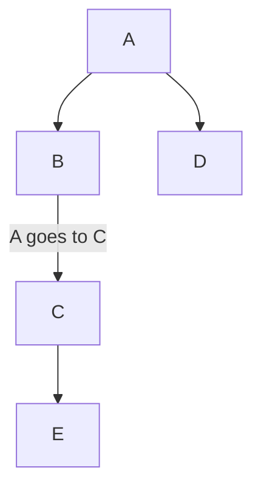

# mid

Render Markdown bullet lists (and Mermaid flowcharts) as graphs — as ASCII for
the terminal/editors, or as structured JSON for native rendering.

TypeScript core + a Bun CLI. Designed to be embedded (e.g. a Neovim plugin that
shells out to `mid render` and shows the graph inline).

## Install

**CLI** — a prebuilt standalone binary (no toolchain needed):

```bash
curl -fsSL https://raw.githubusercontent.com/davidbrackbill/mid/main/install.sh | bash
```

Installs `mid` to `~/.local/bin` (override with `MID_BIN_DIR`). Or grab a binary
straight from [Releases](https://github.com/davidbrackbill/mid/releases).

**Neovim** ([mid.nvim](https://github.com/davidbrackbill/mid.nvim)) — lazy.nvim
downloads the binary for you, no separate CLI install:

```lua
{ "davidbrackbill/mid.nvim", build = "./scripts/install.sh", ft = "markdown", opts = {} }
```

**Obsidian** ([obsidian-mid](https://github.com/davidbrackbill/obsidian-mid)) —
install **Mid** from Settings → Community plugins (self-contained, no CLI needed).

## The DSL is Markdown

A graph is a bulleted list — **indentation defines parent/child**, and a
`- [label](target)` link labels the edge into `target`:

```markdown
- A
  - B
    - [A goes to C](C)
  - D
- C
  - E
```

GitHub renders the graph below — it's the Mermaid that `mid` emits from the
bullets above (`toMermaid`, the same conversion the Obsidian plugin uses):



A name referenced again is the **same** node, so trees become DAGs (here `C` is
shared) and top-level bullets aren't always roots.

Markers `-`, `*`, `+` all work; tabs and spaces both indent; non-bullet lines
(headings, prose) are ignored. Mermaid `flowchart`/`graph` files (`.mmd`) are also
accepted as input.

## Usage

```bash
bun install

# render an example to ASCII (auto-detects .md vs .mmd)
bun run src/cli.ts render examples/tree.md
bun run src/cli.ts render examples/pipeline.mmd

# read from stdin (what editor plugins do)
cat examples/flow.md | bun run src/cli.ts render -

# structured output: { nodes, edges, ascii }
bun run src/cli.ts render --json examples/tree.md

# highlight a node, force a format
bun run src/cli.ts render --select C --format md examples/tree.md

# tests
bun test

# build a standalone binary (no runtime needed to run it)
bun run build        # → dist/mid
./dist/mid render examples/tree.md
```

## API

```ts
import { parse, layout, renderAscii, toJSON } from "./src/index.ts";

const graph = parse(text);          // sniffs md vs mmd; or parse(text, "mmd")
const lay = layout(graph);          // dagre layered layout
const art = renderAscii(graph, lay);
const json = toJSON(graph, lay);    // { nodes, edges, ascii } for SVG/native clients
```

## Layout

`src/` is a small, runtime-agnostic core:

- `markdown.ts` / `mermaid.ts` — parsers → `Graph`
- `model.ts` — `Graph` (nodes by name, deduped edges)
- `layout.ts` — [`@dagrejs/dagre`](https://github.com/dagrejs/dagre) layered layout
- `render.ts` — ASCII box-drawing + JSON serialization
- `cli.ts` — the `mid render` entry point

## Editor plugins

Two thin clients over the core live in `plugins/` — [`plugins/nvim`](plugins/nvim)
(shells out to the CLI) and [`plugins/obsidian`](plugins/obsidian) (imports the core,
renders native Mermaid SVG). See their READMEs.
