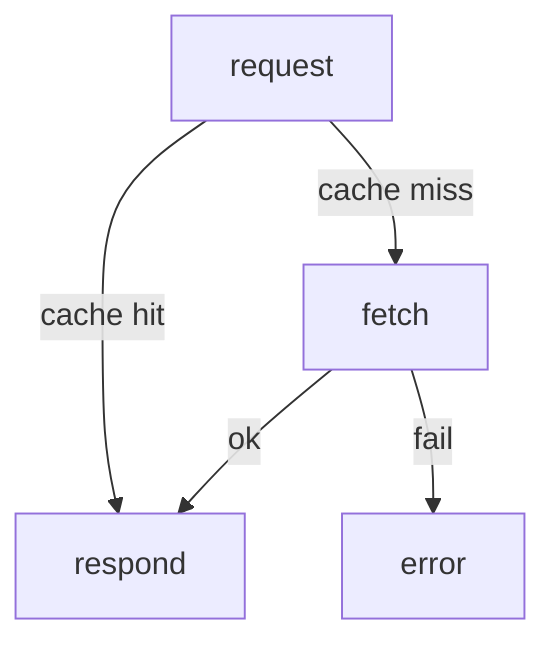

# mid.nvim demo

Open this in Neovim with the plugin loaded. The fenced blocks below render as
inline graphs. Move your cursor over a bullet line — that node highlights in the
diagram. Edit a bullet and it re-renders live.

Normal prose and outlines are left alone (render-markdown's job):

- a regular
  - markdown
  - outline

A mid graph:

```mid
- request
  - [cache hit](respond)
  - [cache miss](fetch)
    - [ok](respond)
    - [fail](error)
```

The same tree written as a Mermaid flowchart, to compare:


